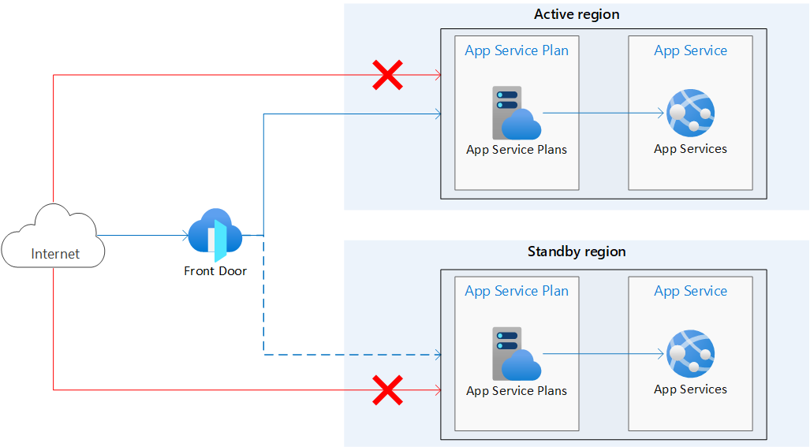

# MultiWebAPPDeplyment

source link :
https://learn.microsoft.com/en-us/azure/app-service/tutorial-multi-region-app

High availability and fault tolerance are key components of a well-architected solution. It’s best to prepare for the unexpected by having an emergency plan that can shorten downtime and keep your systems up and running automatically when something fails.

When you deploy your application to the cloud, you choose a region in that cloud where your application infrastructure is based. If your application is deployed to a single region and the region becomes unavailable, your application will also be unavailable. This lack of availability might be unacceptable under the terms of your application's SLA. If so, deploying your application and its services across multiple regions is a good solution.

In this project, you learn how to deploy a highly available multi-region web app. This scenario is kept simple by restricting the application components to just a web app and Azure Front Door, but the concepts can be expanded and applied to other infrastructure patterns.

The following architecture diagram shows the infrastructure you create in this tutorial. It consists of two identical App Services in separate regions, one being the active or primary region, and the other is the standby or secondary region. Azure Front Door is used to route traffic to the App Services and access restrictions are configured so that direct access to the apps from the internet is blocked. The dotted line indicates that traffic is sent to the standby region only if the active region goes down.

Azure provides various options for load balancing and traffic routing. Azure Front Door was selected for this use case because it involves internet facing web apps hosted on Azure App Service deployed in multiple regions.

With this architecture:

-->Identical App Service apps are deployed in two separate regions.
-->Public traffic directly to the App Service apps is blocked.
-->Azure Front Door is used route traffic to the primary/active region. The secondary region has an App Service that's up and running and ready to serve traffic if needed.

CI/CD link:
Continuous integration with Azure Pipelines - Azure Resource Manager | Microsoft Learn
